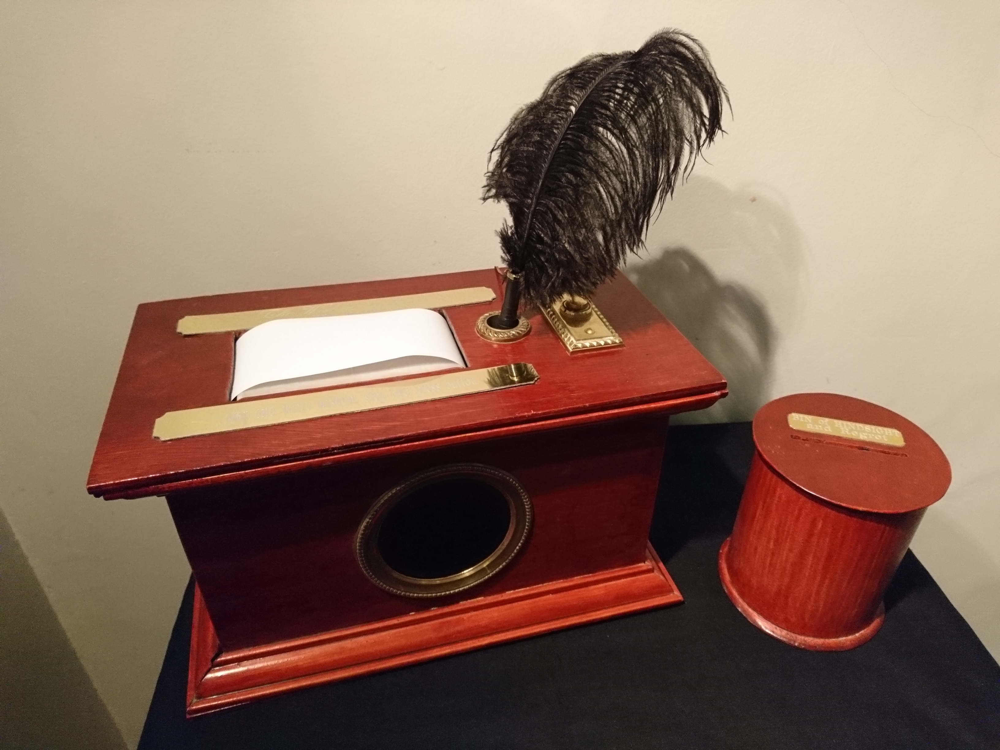

The Wisdom Exchange
===================
An interactive, Arduino-based art project allowing participants to share written words of wisdom.

The Wisdom Exchange consists of a steampunk-style wooden box, a bin with a slot, and a poster.

The poster provides operating instructions:

**WRITE YOUR WISDOM**
upon the Page.  Take note: Original wisdom only!  Every one of us
has in his Life uncovered for himself, through joyful or bitter 
experience, a TRUTH to share, be it profound or trifling.
*In case you have Forgotten to Bring a PEN, a PEN has been provided.*

**PRESS BUTTON TO RECEIVE WISDOM**
If no WISDOM is Forthcoming: REJOICE! for you
already know everything you need. 
*If this does not seem to be the case, kindly inform the staff
that the Wisdom Exchange requires maintenance.* 

**GO HENCEFORTH**
with a Spring in your Step, for you are guided by the Advice and 
Knowledge of Kindly Strangers whom you may Never Meet. 
*Unwanted, unheeded and unappreciated Wisdom may be 
deposited in the Bin of Hindsight and Regret.*

The Wisdom Exchange in action
-----------------------------

Sample Wisdom
-------------

Some example wisdom from an Irish event:

Behind the scenes
=================

